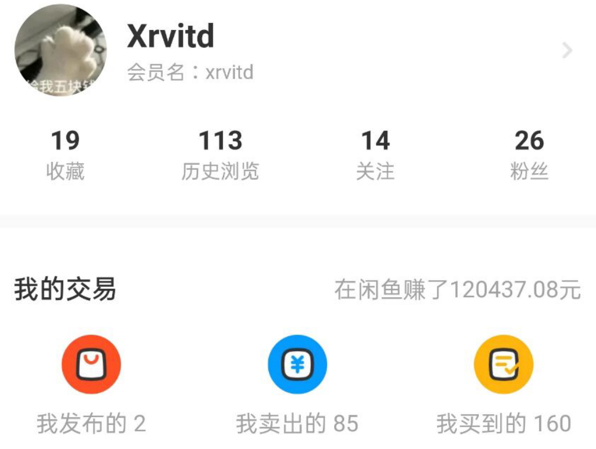

# Xr Biography

## 简介

突然感觉好多事情还是要记录一下，所以就有了这篇日记？博客？传记？不知道是什么的文章。我也不知道之后会不会公开，如果公开了并且你想更加了解xr的话，就读下去吧。

<p align="right">——2020.11.18  下午写于山东大学青岛校区某实验室</p>

## Xrvitd这个id怎么来的?

许多人都问过这个问题，u1s1，没啥好解释的，Xr就是Xr，vitd是乱打的。虽然后面发现英文发音好像不好读，但是也懒得改了...

## iPhone XR?

?苹果公司是啥玩意，建议不要来碰瓷我Xr嗷，还用来给一个边框粗到离谱的机型命名，我怀疑贵司是在讽刺我Xr变胖了嗷。

## 高中

Xr来自山东临清一所不知名的小中学，高一开始听说了信息学竞赛(noip)，被当时的班主任推荐去学一学试试，理由是看我打字很快？hhh然后就走上了一条不归路。

刚开始学的是pascal，然后当年noip2015考前一周左右突然被老师通知说以后都要换c++，然后就开始一周速成c++，刚学完for循环，搜索是啥都不知道，就去考试了，结果当然是很差了。好像只拿了100+(600满分)，当年一起考试的学长们也都只有省二，全校没有一个省一。

然后就开始了为期一年的c++训练，为了noip2016来做准备，因为考试的时候是高三上学期，所以整个大二下几乎都泡在实验室里，至少有一两个月的时间没有去上文化课，现在想想挺孤注一掷的，但是其实当时的想法很简单，就是因为去训练可以不用上课，可以去玩电脑，写代码空闲的时候还可以和其他同学一起MC、LOL，并且被拉着入坑了b站...我也自然而然地成了信息竞赛小组的小组长，虽然我们这一级的只有7个人(四个女生就离谱)，当时刷了不少题吧，导致上了大学之后都没啥兴趣去写题了。印象最深的就是每天晚上去南餐厅买一个炸鸡腿吃，也就是从那个时候开始变胖的吧。现在再看看高中的照片是真的瘦......

大二换了c++语言之后，原来带我们的竞赛教练也换人了，换成了一个基本不会编程的女老师，然后从那以后就都需要我们自学了。OI的教学模式也从老师教变成了学长带学弟。而当时最高届的我自然而然成为了“掌权人”，拿到了机房的钥匙，要给新一届的学弟学妹们讲题，一点一点的教他们c++，当时还给全校办了一场挺大的宣讲会，来介绍编程，介绍OI，还收获了不少小迷妹23333(那时还瘦)。同时也认识了一群很棒的学弟学妹们，到现在还经常联系(此处@by ll zlh)。

不过也还是有点插曲的，比如总会有人说你不是电脑搞的挺NB的吗，为啥才只有个省三？

当时还是有点冲劲的，参加了不少各种各样的培训机构，什么清北学堂学大伟业...基本都去过了，最后也如愿以偿拿到了省一，但是还是因为写反了floyd的内外循环痛失70分...

然后发生了一件事，让Xr的经历变的有趣起来了，当年有个什么空军的计划，选拔完通过之后可以去清华、北大或者北航联培，还是战斗机的飞行员。当时闲着没事就报了。然后就······一层一层的都过的。Xr视力确实挺好的......基本都能看清最后一排的水平。然后通过了学校的招飞、市里的招飞。最后到了济南空军招飞的地方，开始了噩梦之旅......

目前印象最深的是，连续散瞳三四次...然后再去一个机器上看红绿十字啥的，过程太痛苦了。每几分钟往眼睛里滴好多药，然后一直不能睁眼，持续好久好久，过于煎熬以至于不想回忆。还有个转椅，也挺恐怖的，坐上去把你绑在椅子上，然后头枕是可以左右咬得，每一边大概有个60度左右的活动范围，然后坐上去之后每秒钟会有滴的一声的提示音，每听到一次都要把头向反方向摇。然后椅子本身是在很快速的自转的，需要闭着眼睛上。整个给人的感觉就是自己变成了一个球在一个更大的球里面撞来撞去，然后自己好像要被甩飞出去一样，自己还要极力控制不飞出去，并且每秒摇头。有不少下来直接吐的，那场面真是hhhhh。

后来？后来就过了。然后我就成了高中的希望，甚至还去百日誓师代表学生发言了，毕竟据说清华降七八十分呢，然而我根本就不想去。别问，问就是怕死。那可是战斗机啊，老怂包了。而且NOIP省一已经保底山大了。所以高三基本就都在玩了。自主招生保了哈工大，山大和华东理工。哈工大降70，后两个一本线。

然后高考完出成绩，加上70之后刚好和哈工大的投档线差一两分，怂了，不敢冲，就山大保底了。这里插一段当时写的blog:

```
所以最后还是靠自招。
为了最大限度地发挥一等奖的作用，去考了三个大学。哈工大冲高，山大求稳，华理保底。
有趣的是，三所大学全都是免笔试。
6.11去济南，山大中心校区。面试。
抽到了靠后的号码，最后厚着脸皮和一个靠前的人换了号，就为了赶上回去的车。。。
然后被问到冒泡排序，巧了，我不会。。。。
（你一个一等奖连冒泡都不会可以去死了0.0）
后来去华理，被问数学奥赛题。。。
HIT。5分钟看俩题，只看完了第一个树形DP，第二个主观题看都没看就进去了。。
虽然自招的过程惨不忍睹，但是三所自招居然都过了。
但是高考炸了。HIT差了2分。只好去世一大了。。。
嗨呀山大的青岛校区还可以的，最起码宿舍条件好啊。
然后就开始准备暑假的培训班，各种空间朋友圈宣传。还去发传单。
最后就招了7个人，还跑了俩。。。。
算算房租加上饭钱，根本赚不到钱 啊。
现在有空的时候也在看JAVA，艺多不压身嘛。还准备在B站发自己的视频，做一名新人UP主，哈哈哈。
未来还有很长
活的快乐就好。
								2017.7.31
```

还蛮乐观的，后来也证实了去山大是个好选择，OI去HIT的绝大部分都被调剂到经管了hh，也算是因祸得福吧。空军的事情也再也没提过。


## 大学

### 泰山学堂

Xr是自主招生的时候知道的泰山学堂这个东西，当时的自招面试地点在中心小区，正好有个16级的计科学长在中心校区，就被他带着逛了逛中心，并且在中心地下超市旁边的理发店剪了次头(噩梦，记忆犹新)。然后知道了泰山学堂住研究生宿舍，4人间上床下桌还有**空调**！对Xr这个怕热人士简直太友好了。于是就准备开学之后考一考泰山学堂试试......

后来开学之后发现，青岛校区虽然也是四人间有独卫，但是居然没有空调？这能忍？并且报**学堂**(这样叫有歧义，但是emm叫习惯了)还能逃军训！然后就报名了去笔试了。笔试好像是数学+专业能力两场，当时应该是考了第三还是第四来着。面试有很多轮，学长面教授面，好像还有心理面试来着。最后录取基本上都是按照笔试排名来的，不过好像我隐约记得有个排名靠前的妹子面试被刷了。

然后就去济南中心校区了，课少了许多，学堂没有思修之类的没啥用的课，都是数学英语和专业课，数学要学数学分析，按照数学院的标准来，就离谱。当时刚上大学还对各种事情比较热心，就混了个宣传委员当当。哦，还认识了前女友。

再往后比较有印象的事情就是学堂的迎新晚会了，在山大圣昆仑音乐厅里，节目、场地各种设备都是我们来负责，只有摄像是外包的。那时候是真的开心啊，一个人负责几乎所有节目的背景视频，然后还实装了弹幕系统(虽然就是调轮子)，迎新开始的时候还要控制四五块大屏幕的内容以及全场的声音。后来摄影团队返给我原视频之后还要负责剪辑，并且刻成光盘。还要设计光盘的外观以及盒子......哦，还有这场晚会的门票。真能干.jpg

最后的视频还发b站了👇

[泰山学堂2017迎新晚会](https://www.bilibili.com/video/BV1GW411b7Hn)

后来......后来就。

挂了离散数学。

(以下可能存在敏感内容)

因为Xr和学堂的一众老师们关系还不错，所以第一时间去找了A老师。被嘲讽+批评一番之后告诉我不要怕， 不会退堂的，我给B老师打个电话。然后就当面给B老师打电话说了我的情况，我就以为没事了。

下学期开学两周后，正值退补选。接到了当时计科的班主任辛老师的电话，告知我尽快办手续转出学堂，回青岛计科。

人都傻了。

当晚联系A老师联系不上，联系了C老师后，C老师说让我给D老师写封邮件，保证以后好好学习不挂科之类的......

然后。

```
很抱歉，学堂有自己的运行规则。在昨天学堂的会议上，学堂总负责人再三强调流转事宜。

是金子总会发光的，希望您流转到计算机学院后，发光发热。
```

第一次挣扎，失败。

第二天，联系到了A老师，被批评为什么着急给D老师发邮件而不是等第二天来找他。随后联系B老师，被告知现在的D老师说了算。

第二次挣扎，失败。

联系E老师。

```
你去写一份保证书，然后看能不能找几个关系好的室友、同学帮你一起签。
比如以后再挂科

大家一起退堂

之类的。
我也帮你签，大不了我这**不当了。
```

现在想想真是可笑，不过当时确实是有任何希望都想要抓住。

跟当时的室友约了饭，说了这件事。

都答应了。

(此处省略内疚1w字)

然后写了保证书，签了字。

```
    ...
    ......
    我们相信Xr同学的能力，愿意为Xr同学担保，希望教授小组相信我们。
    	
    																				担保人：xxx,xxx,xxx
    																				E老师
```

这两张纸，现在也还被我好好地保存着。

最后的结果，

当然是没有起到什么作用的。

第三次挣扎，失败。

后来，跟时任学堂副院长的F老师聊了聊，因为Xr不能说和老师们关系都很好吧，至少混了脸熟。F老师也给D老师打了电话。

虽然，打电话的时候，是背着我的。没有听到具体的内容。

但是结果是没变的。

该走还是要走。

第四次挣扎，失败。

除了我之外，还有一个绩点比我还低一些的同学。

他的父母也来了，跟我说：

“要不试试校长信箱吧。”

因为当时。其他的取向(非计算机)，好像是有人也挂了科的。并且没有收到流转的通知。

但是还是被老师们拦下来了。

理由是会影响泰山学堂的名誉。

现在想想也不应该就此罢休的。

第五次挣扎，失败。

然后就回青岛了。

自己一个人。

把所有东西打包，寄了顺丰。

自己背着包，拉着行李箱，上了高铁，到了东里村。

hhh感觉自己就像是被放逐的。

突然就来到了熟悉又陌生的地方。

当时还有联系的只有yzh了，要不是他我甚至不知道怎么从高铁站坐车去学校.....

依稀记得，当时考进学堂，计科的导员跟我说，等你回来。没想到真回来了，还早了半年。

导员还是ltl老师，告诉我班级宿舍随我选，菁英班也可以。

然后辛老师约我喝了杯咖啡，告诉我有啥问题都可以去找他，然后不要选菁英班，对保研有影响。并且如果对科研有兴趣就过了这学期去找他。

然后就回到了原来，最开始的班级，最开始的宿舍。

好像没去过学堂一样hhh。

后来，偶然间从学长学姐们口中得到了一个信息

```
  上一级计算机取向的某同学，也是大一上学期挂了一门专业课，但是依然在学堂待到了下学期，直到又挂了两门之后才走。(小道消息，不保真)
```

原本都想在青岛，在计科重新做人了，得知这件事之后，又气又恨。

于是联系了D老师，当面聊。

拿上一级某同学的例子举证，寻求能回学堂的机会。

hhhh，刚说了两句话。

```
    不行，学堂有学堂的规则。
    我还约了X老师，再见。
```

......第六次？失败(其实后来有很多人都说D老师那里很吃香，为啥不去，现在估计明白了叭。还请读者帮忙保密，还不想死)。

然后和A老师联系的时候提到了这件事，A老师说你加油弄几个国家级的奖，说不定有机会可以回来。

然后就开始冲深圳杯国一，冲了两次一个国二一个国三。数学建模国赛也拿了一个国一。

后来找负责建模的G老师聊，希望能帮忙联系一下能不能回学堂的事。

G老师："我觉得泰山学堂没啥好的，想去那干啥"。

此时距离退堂已经过去了两年的时间。

也没什么可以再挣扎的了。

遂放弃。


### 闲鱼带师

Xr精通闲鱼倒卖二手之道，遂称闲鱼带师。



不过交易额也就12w而已，感觉没啥好说的emmm.

既然如此，那就梳理一下我的设备更替历史吧..

闲鱼起于刚上大学的时候，家里准备斥巨资给Xr买一台笔记本，当时(2017年)看上了Razer blade pro 17寸 ，国航要价3w+

所以就在闲鱼搞了个，斥资了28000r.

一个月后，rog 发布了第一代冰刃GX501，比我的小还薄配置还高还便宜，于是趁着还没铺货，出掉了Razer blade pro 17寸，售价29000r.

啊，没错，反而赚了1000r，离谱。

然后去闲鱼收了个美行的信的GX501,斥资16999r.

然后背着gx501上了大学，上面说的泰山学堂迎新晚会也是全靠GX501顶住的。

然后来青岛之后，razer发布了Razer blade 15.6 . 做工实在是太好了，然后就吧GX501出掉了，回血15010.没亏太多(斜眼笑)。

然后就买了三台Razer blade 15.6 ，因为说服了磊磊和博远和我一起买，23333. 斥资17000r. 印象里是8750h+1070.

哦对，在这期间还买了一台surface pro 5 .不过不是闲鱼，直接买的新的，斥资8000r，肉疼。后来给前女友了，所以没能回血。不过把她当时的笔记本出掉了，回血3600。

然后大二花不到2000组了一台台式机，i3 8100  16+128 GTX950.用了有一个月感觉性能太垃圾了，就1650出掉了。

然后Razer blade 15.6出了新款，2080的显卡，心动，10000r除掉了我的1070版本的，换了2080的。斥资17000r，这次亏得比较多，因为时间过得比较久了。

用了一段时间之后，感觉徒有2080，天天都在LOL，没啥用，遂16500r出掉了。这波不亏。

然后就用这16500r自己又垫了点，组了一台台式机+一个华为matebook x pro。

台式机3800x+rtx2080ti. Xr2080ti只打LOL从此而来 。

后来论文ddl，需要渲染图片，就换了3900x。

显卡出掉换了七彩虹的2070super。

然后发现华为matebook x pro实在是太垃圾了，我就不应该信任华为，散热烂的一批，60帧的屏幕看着和30帧一样，把我恶心到了。

然后卖掉收了个surface pro 6.

然后上面这些 3800x 2350r回血 3850r购入3900x。

Rtx2080ti 万图师 6700r购入 6900r回血，血赚。

matebook x pro 5900r购入 5000r回血

surface pro 6 5400r购入 4200r回血 用了挺久。

然后就到了疫情期间，憋在家里，surface出了之后，为了体验macbook， 8700r收了一台mbp 18款13寸 8+512.

然后就去了杭州，去阿里实习。

mbp不好用，直接去楼下电脑城7000回收了。

然后换了ITX机箱，除了3900x都换了一遍。

显卡换了技嘉小雕RTX2080. 然后笔记本换了razer blade 13寸。


以上。 截止到2020.12.2。

哦，上面只是电脑，其他设备其实也差不多，手机键盘平板啥的，也换了不少23333.

所以看起来12w的盈利，其实都是各种倒卖，Xr还是一个穷逼。

hhhhh......


### 白嫖顺丰

这是一个小故事hhh

起因是因为我大三的时候一直都是用的自己diy的显示器，没有外壳，不方便运输，所以寒假没办法寄回家用。

而正巧sxb准备去实习，显示器扔宿舍用不到，于是就被我借回家用了。

然后就赶上了疫情，半年都回不去学校了。途中sxb在闲鱼把这台显示器卖了，让我帮忙给买家寄过去。

价格好像是1k，然后我就顺丰保价1k寄过去了。

后来买家说花屏了，给退回来。

然后就开始和顺丰battle。和各种客服互怼，还去做了检测证明。最后顺丰给赔了1000r.

然后，因为是京东买的显示器，只是花屏了，外面看不出来有损伤。

就找dell报修了，然后给换了个新的......

1000r给sxb了，我白嫖一个新显示器hhhhh...


2021.1.15更新：

今年寒假放假回家的时候把台式机打包寄顺丰回家了，保价保了12000.

然后回家去快递点自提验货的时候，发现显示器通电之后角落里一片发白，感觉像是被挤压了......顺丰快递员说那就理赔吧，反正外包装没事，我不负责任。

然后就帮我给客服打电话，还以我的口吻要求赔钱hhh....

然后翻了翻当时是2950买的，而且因为是diy显示器基本上没法修，所以就说了赔2950....

刚开始说损坏不严重，只能赔7倍运费(不算保价)大约350块，被我拒绝了。

然后第二天就打了2950过来......

问题是我把显示器搬到家里组装好电脑用了一会儿之后发现没事了......显示很正常.....

阿巴阿巴....好像白嫖了3000r....

我问心有愧啊....

(不过感谢顺丰救了一手经济危机的xr，来日定当涌泉相报！(指以后还保价发顺丰))

### 歪歪曲曲的保研路

writing...


